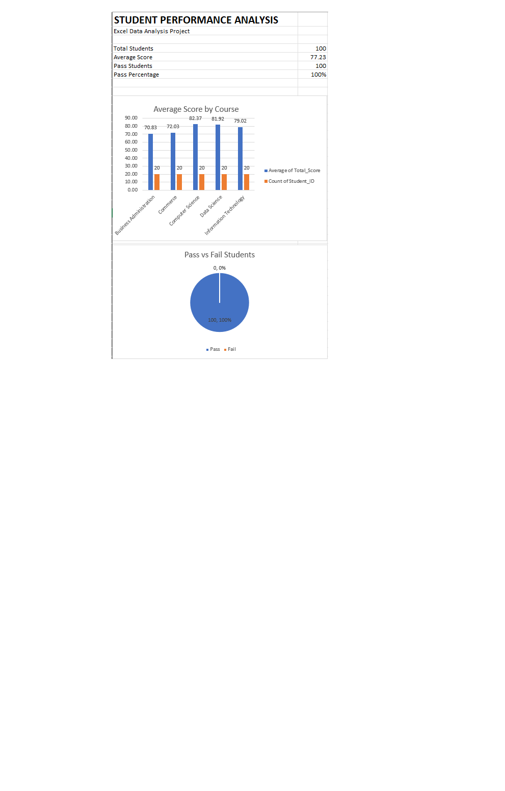

# Student Performance Analysis

## Project Overview

This project analyzes student performance data using Microsoft Excel. The analysis focuses on student scores, course-wise performance, and overall pass percentage.

## Objectives

- Analyze student academic performance
- Calculate average assignment, midterm, final, and overall scores
- Compare performance across different courses
- Calculate pass and fail students
- Create a simple Excel dashboard

## Tools Used

- Microsoft Excel
- Excel Formulas
- Pivot Tables
- Charts
- Data Visualization

## Dataset

The dataset contains 100 sample student records with the following fields:

- Student ID
- Gender
- Course
- Attendance
- Assignment Score
- Midterm Score
- Final Score
- Overall Score
- Result

The dataset is synthetic and created for educational/portfolio purposes.

## Analysis Performed

The project includes:

- Average Assignment Score
- Average Midterm Score
- Average Final Score
- Average Overall Score
- Highest Overall Score
- Lowest Overall Score
- Pass and Fail Student Count
- Pass Percentage
- Course-wise Average Score

## Dashboard

The Excel dashboard presents key performance metrics and visualizations.



## Key Results

- Total Students: 100
- Average Overall Score: 77.23
- Pass Students: 100
- Pass Percentage: 100%

## Project Structure

```text
student-performance-analysis/
│
├── Student_Performance_Analysis.xlsx
├── dataset.csv
├── dashboard-preview.png
└── README.md

Skills Demonstrated
Data Analysis
Microsoft Excel
Excel Formulas
Pivot Tables
Data Visualization
Dashboard Creation

